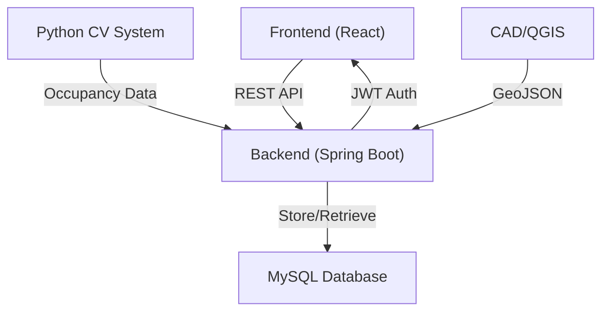

# Parking Manager: A Full-Stack Solution

<aside>
A comprehensive parking management system combining modern web technologies, computer vision, and geospatial data processing.

</aside>

# Overview

The Parking Manager is an innovative full-stack solution that seamlessly integrates parking spot management, user authentication, and real-time occupancy detection.

## Key Features

- Real-time parking spot monitoring
- Secure user authentication with role-based access
- Interactive 2D parking map visualization
- Automated occupancy detection via computer vision

## Technology Stack

### Backend Infrastructure

<aside>
**Spring Boot Framework**

- RESTful API endpoints
- JWT-based authentication
- Role-based access control
</aside>

### Frontend Application

<aside>
**React + TypeScript**

- Vite build system
- Material-UI components
- Interactive Konva canvas
</aside>

### Computer Vision

<aside>
**Python + OpenCV + YOLO**

- Real-time detection
- Polygon mapping
- Occupancy analysis
</aside>

## System Architecture

## Implementation Details

- **Authentication Flow**
    
    
    | **Role** | **Access Level** | **Capabilities** |
    | --- | --- | --- |
    | ADMIN | Full | System management, user control |
    | VIP | Enhanced | Priority booking, extended features |
    | PERSONNEL | Limited | Basic operations, spot management |
    | USER | Basic | Spot viewing, reservations |
- **Geospatial Processing**
    - CAD drawings converted to GeoJSON format
    - Parking spot polygons stored with unique identifiers
    - 1:1 mapping between virtual and physical spaces
- **Occupancy Detection**
    - YOLO model processes camera feeds
    - Real-time polygon intersection analysis
    - WebSocket updates for instant status changes

## Future Enhancements

### Short Term

- [ ]  Enhanced error handling
- [ ]  Performance optimization
- [ ]  Mobile responsiveness

### Long Term

- [ ]  AI-powered predictions
- [ ]  Multiple camera support
- [ ]  Analytics dashboard

## Development Guidelines

> All components follow strict typing and documentation standards to ensure maintainability and scalability.Use meaningful commit messages following conventional commits
>
